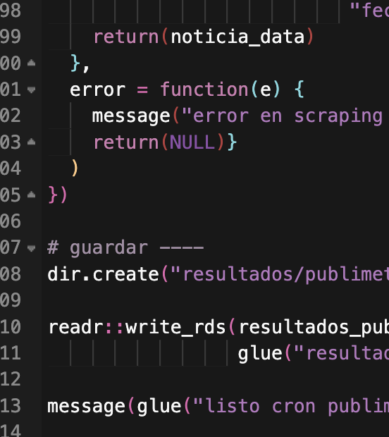
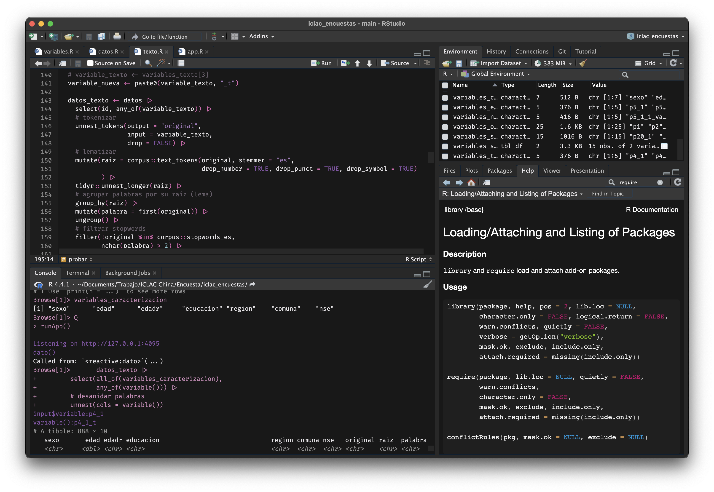

# base16 purple dark

RStudio theme focused on a purple and pink color palette, based on the _base16 Default Dark_ theme from [`{rsthemes}`](https://github.com/gadenbuie/rsthemes?tab=readme-ov-file), which in turn is based on [base16](https://github.com/chriskempson/base16).

## Installation

To add this theme to your IDE, download the `.rstheme` file in this repository, then open RStudio's _Global Options_ (`⌘;`), choose _Appareance_, press the _Add..._ button at the bottom, and choose the `base16-purple-dark.rstheme` file in your device.