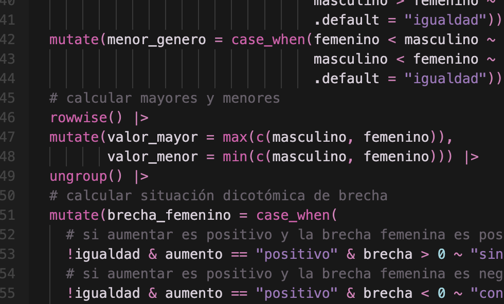
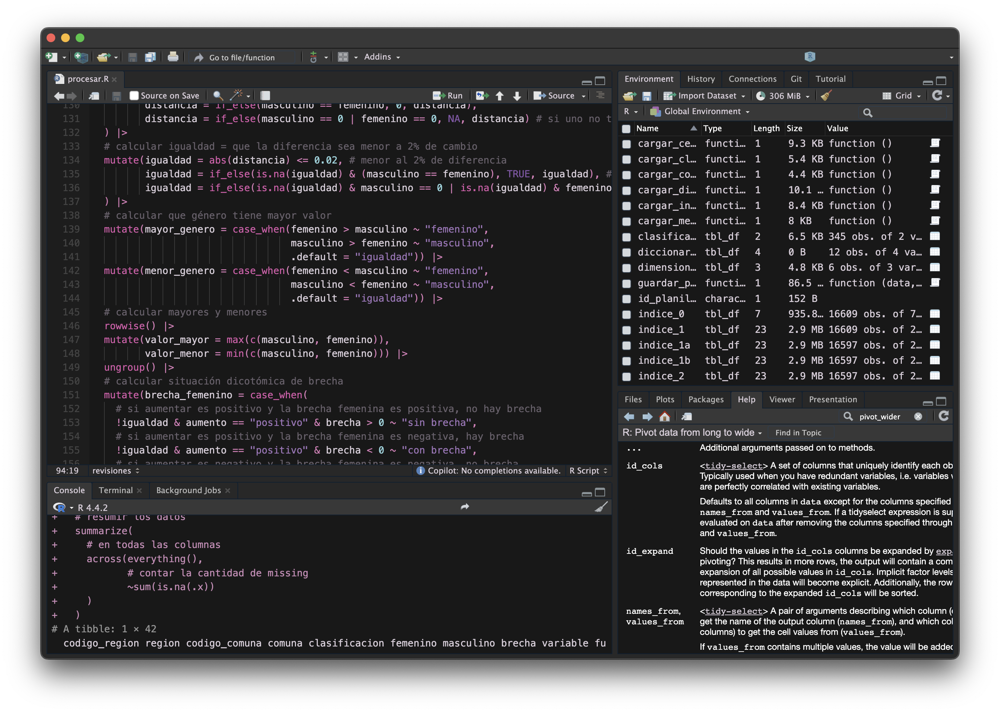

# Basti Purple Dark (y Light)



Temas para RStudio con una paleta morada y rosada. El oscuro parte del
_base16 Default Dark_ de [`{rsthemes}`](https://github.com/gadenbuie/rsthemes),
que a su vez viene de [base16](https://github.com/chriskempson/base16); el
claro parte del tema _Tomorrow_.



## Instalación

Descarga `basti-purple-dark-2.rstheme` (o `basti-purple-light-2.rstheme`) de
este repositorio. En RStudio, abre _Global Options_ (`⌘;`) → _Appearance_ →
botón _Add..._ y elige el archivo.

Los archivos sin el `-2` son las versiones anteriores, mantenidas a mano, que
se conservan solo para comparar. Están rotas en RStudio 2026.07 y posteriores.

## Para desarrollarlo

Los `.rstheme` **se generan**; no se editan a mano. La fuente está en
`fuente/`:

```
fuente/dark/01-cabecera.css     metadata del tema
fuente/dark/02-editor.css       resaltado de sintaxis      (generado, no editar)
fuente/dark/03-ide.css          chrome básico              (generado, no editar)
fuente/dark/04-terminal.css     paleta del terminal        (generado, no editar)
fuente/dark/05-estable.css      parches con clases estables de RStudio
fuente/dark/06-chrome.css       parches con nombres semánticos
```

Para regenerar e instalar:

```r
source("probar.R")
```

Los temas generados salen como `basti-purple-<tema>-2.rstheme`, y RStudio los
muestra como "Basti Purple Dark 2" / "Basti Purple Light 2". El sufijo existe
para poder tenerlos instalados junto a los anteriores hechos a mano sin que se
pisen; se cambia con `construir_tema("dark", sufijo = "")`.

### Por qué hay dos archivos de parches

RStudio documenta un conjunto de clases CSS estables (`.ace_*`, `.xterm*`,
`.rstudio-themes-*`, `.rstheme_*`, `.gwt-*`, `#rstudio_*`, atributos ARIA).
Todo lo que use esas clases va en `05-estable.css` y funciona en cualquier
versión de RStudio.

Pero el resto de la interfaz —bordes de paneles, barra de estado, panel de
entorno, diálogos, outline— no tiene API: RStudio la estiliza con clases que
GWT ofusca al compilar, y cuyo nombre cambia en cada versión (`GFRCULXJX` hoy,
`GBQS1KEBKX` en 2026.04, `GNJ4OY0CFX` antes). Por eso el tema se rompía en
cada actualización.

En `06-chrome.css` esos elementos se escriben con su nombre semántico:

```css
.rstudio-themes-dark-grey .{{ThemeResources.windowFrameObject}} > div:last-child {
    border-color: #111111;
}
```

y `construir_tema()` los traduce a las clases de la versión instalada. El mapa
se extrae de la propia instalación de RStudio, cruzando
`www-symbolmaps/*.symbolMap` con `www/rstudio/*.cache.js`.

### Modificar un aspecto ofuscado

Paso a paso, para cuando haya que retocar una parte del chrome del IDE.

**0. Cargar las herramientas.**

```r
source("R/mapa-clases.R"); source("R/construir.R"); source("R/doctor.R")
```

**1. Obtener el nombre semántico del elemento.** Dos caminos según lo que se
tenga a mano:

```r
buscar_clase("GFRCULXHW")     # desde una clase ofuscada -> ThemeResources.toolbarButton
buscar_miembro("statusbar")   # desde una idea del elemento; busca en 1546 nombres
```

`buscar_miembro()` acepta expresiones regulares y no distingue mayúsculas.
Los nombres van como `Recurso.miembro`, donde el recurso corresponde a la
clase Java de RStudio: `ThemeResources`, `EnvironmentObjectList`,
`DocumentOutlineWidget`, `FindReplaceBar`, `VirtualConsole`, etc.

Si `buscar_clase()` no devuelve nada, la clase es de una versión anterior de
RStudio (ver `doctor()`) o es una de las ~115 que el mapa no sabe nombrar.

**2. Confirmar que el nombre es el elemento correcto.** Este paso no es
opcional: los sufijos de las clases ofuscadas se desplazan entre versiones, así
que un mismo sufijo apunta a elementos distintos en versiones distintas.

```r
css_rstudio("ThemeResources.toolbarButton")
#> ThemeResources.toolbarButton -> .GFRCULXHW
#>   .GFRCULXHW{border:none;background-color:transparent;margin:0 8px 0 0;...;height:21px;...}
#>   .GFRCULXHW[disabled]{opacity:0.3;color:#333;cursor:default;}
```

Imprime las reglas que RStudio le aplica a esa clase, extraídas de su CSS
compilado. Si las declaraciones no cuadran con el elemento que se quiere
tocar, el nombre está mal.

Ejemplo real de la trampa: `GNJ4OY0CFS` (RStudio 2025) era
`ThemeResources.header`, pero `GFRCULXFS` (2026.07) es
`ThemeResources.gutterInfo`. Y el parche del botón de modo visual apuntaba a
la clase del toolbar en la posición del botón, porque los cuatro sufijos de la
cadena se habían corrido una posición.

**3. Escribir la regla en `fuente/dark/06-chrome.css`**, con el nombre entre
llaves dobles en lugar de la clase:

```css
/* botones de la barra de herramientas */
.rstudio-themes-dark .{{ThemeResources.toolbarButton}} {
    background-color: #383838;
    border-color: #161616;
}
```

Convenciones del archivo: un comentario en español por regla describiendo qué
elemento arregla, y lo más nuevo al final. Si el selector no necesita ninguna
clase ofuscada, la regla va en `05-estable.css`, no acá.

**4. Regenerar y aplicar.**

```r
construir_tema("dark", instalar = TRUE)
```

Nunca editar el `.rstheme`: se sobrescribe en cada build.

**5. Si el build falla**, es que algún nombre no resuelve. El error lista los
nombres afectados y sugiere los parecidos del mismo recurso. `doctor()` da el
panorama completo.

### Después de actualizar RStudio

```r
source("R/mapa-clases.R"); source("R/doctor.R")
doctor()                      # qué clases cambiaron y cómo se llaman ahora
buscar_miembro("outline")     # buscar el nombre de un elemento
buscar_clase("GFRCULXPQC")    # traducir una clase ofuscada a su nombre
css_rstudio("FindReplaceBar.optionsPanel")   # ver el CSS propio de RStudio
```

Si un nombre semántico deja de existir, `construir_tema()` falla y dice cuál,
en vez de generar un tema roto en silencio. Con `estricto = FALSE` genera el
tema igual, omitiendo solo las reglas afectadas.
