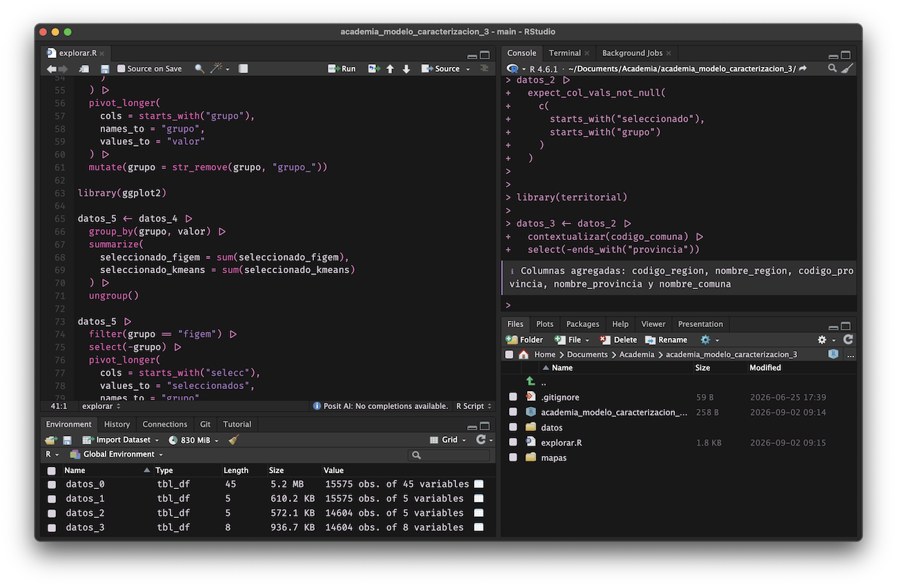

# Basti Purple Dark (y Light)



Temas para RStudio con una paleta morada y rosada. El tema oscuro se basa en
_base16 Default Dark_ de [`{rsthemes}`](https://github.com/gadenbuie/rsthemes),
que a su vez viene de [base16](https://github.com/chriskempson/base16); el tema
claro se basa en el tema _Tomorrow_.


## Instalación

Descarga `basti-purple-dark.rstheme` o `basti-purple-light.rstheme` de
este repositorio. En RStudio, abre _Global Options_ (`⌘;`) → _Appearance_ →
botón _Add..._ y elige el archivo.

Estos temas son generados a partir del script `aplicar.R` para que funcionen correctamente con la **última** versión de RStudio.

Si actualizaste RStudio o no tienes la última versión, clona este repositorio y ejecuta `aplicar.R` para generar y aplicar una versión del tema específica para tu versión de RStudio.

## Generar temas

La fuente de los `.rstheme` está en la carpeta `fuente/`:

```
fuente/dark/01-cabecera.css     metadata del tema
fuente/dark/02-editor.css       resaltado de sintaxis      (generado, no editar)
fuente/dark/03-ide.css          chrome básico              (generado, no editar)
fuente/dark/04-terminal.css     paleta del terminal        (generado, no editar)
fuente/dark/05-estable.css      parches con clases estables de RStudio
fuente/dark/06-chrome.css       parches con nombres semánticos
```

Desde estas hojas de estilos se genera el tema. Para regenerar, instalar y aplicar el tema:

```r
source("aplicar.R")
```

Los temas generados salen como `basti-purple-<tema>-2.rstheme`, y RStudio los
muestra como "Basti Purple Dark 2" / "Basti Purple Light 2". 

### Razón

Hay dos tipos de elementos en la interfaz de RStudio: los que tienen clases CSS estables (`.ace_*`, `.xterm*`,
`.rstudio-themes-*`, `.rstheme_*`, `.gwt-*`, `#rstudio_*`, y los que no tienen.

Los aspectos del tema que tienen una clase estable van en en `05-estable.css` y funciona en cualquier
versión de RStudio.

Pero el resto de la interfaz (bordes de paneles, barra de estado, panel de
entorno, diálogos, outline) no tienen clases: RStudio las estiliza con **clases ofuscadas**, y cuyo nombre cambia en cada versión (`GFRCULXJX` hoy,
`GBQS1KEBKX` en 2026.04, `GNJ4OY0CFX` antes). Esto hacía que el tema se echara a perder con cada actualización de RStudio.

En `06-chrome.css` esos elementos se escriben con su _nombre semántico_:

```css
.rstudio-themes-dark-grey .{{ThemeResources.windowFrameObject}} > div:last-child {
    border-color: #111111;
}
```

La función `construir_tema()` traduce los nombres semánticos a las clases ofuscadas de la versión instalada. El mapa
se extrae de la propia instalación de RStudio, cruzando
`www-symbolmaps/*.symbolMap` con `www/rstudio/*.cache.js`.

### Modificar una clase ofuscada


```r
source("R/mapa-clases.R"); source("R/construir.R"); source("R/doctor.R")
```

Obtener el nombre semántico de la clase ofuscada:

```r
buscar_clase("GFRCULXHW")     # desde una clase ofuscada -> ThemeResources.toolbarButton
```

Confirmar que el nombre es el elemento correcto:

```r
css_rstudio("ThemeResources.toolbarButton")
#> ThemeResources.toolbarButton -> .GFRCULXHW
#>   .GFRCULXHW{border:none;background-color:transparent;margin:0 8px 0 0;...;height:21px;...}
#>   .GFRCULXHW[disabled]{opacity:0.3;color:#333;cursor:default;}
```

Lo anterior imprime las reglas que RStudio le aplica a esa clase, extraídas de su CSS
compilado.

Luego escribir la regla CSS para la clase ofuscada en `fuente/dark/06-chrome.css`, con el nombre entre
llaves dobles en lugar de la clase:

```css
/* botones de la barra de herramientas */
.rstudio-themes-dark .{{ThemeResources.toolbarButton}} {
    background-color: #383838;
    border-color: #161616;
}
```

Si el selector no necesita ninguna clase ofuscada, la regla va en `05-estable.css`.

Luego reconstruir el tema y aplicarlo con:

```r
construir_tema("dark", instalar = TRUE)
```

Si el build falla es que algún nombre no resuelve. El error lista los
nombres afectados y sugiere los parecidos del mismo recurso. `doctor()` da el
panorama completo.

